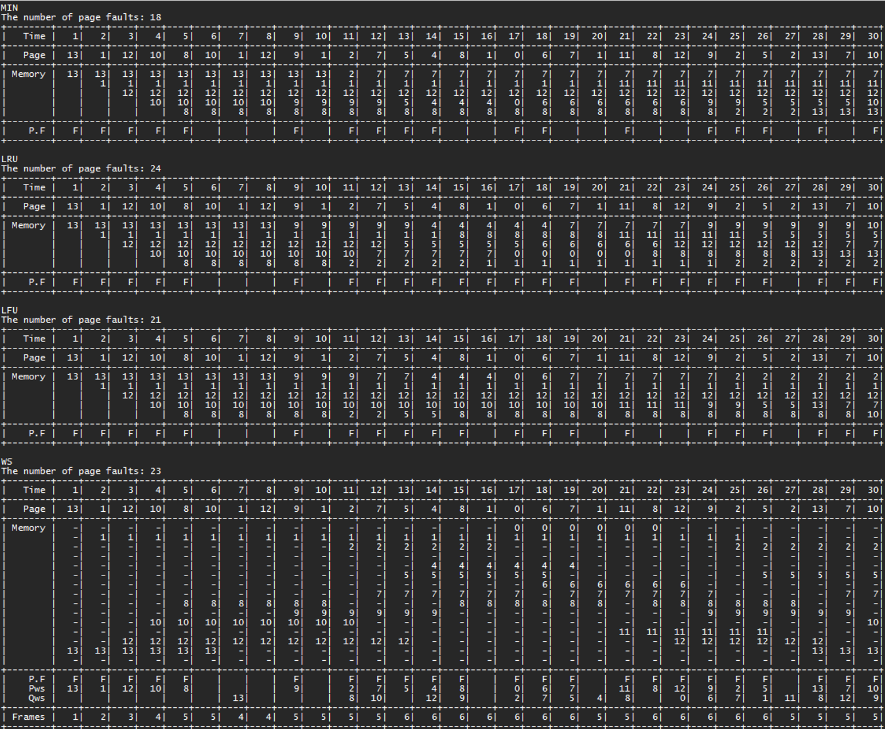

# OS-Virtual-Memory-Management
성균관대학교 운영체제 과제3 - Virtual Memory Management 기법 구현  

## 1. 설계/구현에 사용한 도구
### a. 개발 환경 및 실행방법
#### (1) 개발 플랫폼 
Visual Studio Code (version: 1.73.1)
#### (2) 컴파일러 및 OS 버전
gcc (Ubuntu 11.3.0-1ubuntu1~22.04) 11.3.0
#### (3) source 
main.c, IO.c, simulator.c   
VM_simulator.h
#### (4) 실행 방법
gcc -o a main.c IO.c simulator.c && ./a
 

## 2. 설계/구현 내용
### a. main.c
다음과 같은 순서로 시뮬레이션을 진행합니다.
1) input을 읽고 예외처리를 진행합니다.
2) 올바른 input이 들어왔다면 Virtual Memory Management 시뮬레이션을 진행합니다.
3) 실행 결과가 담긴 Table을 출력합니다.
### b. VM_simulator.h
시뮬레이션에 필요한 라이브러리와 구조체, 변수, 함수 등이 선언되어 있는 헤더 파일입니다.       
1) enum _strategies
    Replacement starategies(MIN, LRU, LFU, WS)를 열거형으로 정의하였습니다.
2) struct _table
    시뮬레이션 결과의 저장과 출력에 필요한 구조체입니다.  시간별 page number, memory 상태, page fault 여부 등을 저장합니다.
3) int pageFaultCount[]
각 Replacement starategy의 총 page fault 횟수를 저장합니다.
4) int Qws[], int frameCount[]
	Working set algorithm의 시뮬레이션 결과 출력을 위해 필요한 배열이며, 시간 별 교체된 페이지, 시간 별 할당된 프레임 수를 저장합니다. 
5) int N, M, W, K
    각각은 Process가 갖는 page 개수, 할당된 page frame의 개수, window size, page reference string의 길이를 저장합니다.
6) int *refString
	입력 받은 Page reference string을 저장합니다.
7) int *memState
	시간별 메모리의 페이지 할당 상태를 저장합니다.
8) int *refTime
	LRU algorithm 구현을 위하여 각 page frame의 reference time을 저장합니다. 
9) int *refCount
    LFU algorithm 구현을 위하여 각 page frame이 reference된 횟수를 저장합니다.

### c. IO.c
#### 1) readInput()
	1-1) 파일 열기를 실패한 경우 다음 메시지를 띄우고 프로그램을 종료합니다.
	1-2) input file의 예외처리를 진행합니다.
입력은 input.txt 파일에 다음과 같이 주어져야 합니다.
 
N: process가 갖는 page 개수 (1 ≤ N ≤ 100)  
M: 할당 page frame 개수 (1 ≤ M ≤ 20) 
W: window size (0 ≤ W ≤ 100) 
K: page reference string 길이 (1 ≤ K ≤ 1000, 0 ≤ page < N) 
형식이 맞지 않는 경우 에러 메세지를 띄우고 프로그램을 종료합니다.
 
#### 2) printTable(Strategies replacement) 
총 4가지 replacement strategy를 사용한 시뮬레이션 결과를 출력합니다. 운영체제 수업 강의자료(OS10(VirtualMemoryMgmt))와 mySQL의 database table 출력형식을 참조하였습니다. 
2-1) Fixed allocation based replacement 
Fixed allocation을 사용하는 MIN, LRU, LFU algorithm의 경우 시간별 page, memory state, page fault 여부를 출력합니다. 출력 예시는 다음과 같습니다.
 
2-2) Variable allocation based replacement
Variable allocation을 사용하는 working set memory management의 경우 2-1)항목에 더해 들어온 페이지(Pws), 나간 페이지(Qws), 할당된 프레임 수(Frames)를 보여줍니다. 출력 예시는 다음과 같습니다. 
 
### d. simulator.c
총 네 번의 시뮬레이션이 차례로 진행되며, Fixed allocation based replacement인 MIN, LRU, LFU algorithm 시뮬레이션 이후 Variable allocation based replacement인 WS algorithm이 시뮬레이션 됩니다. 각 시뮬레이션이 진행될 때 출력을 위하여 선언한 stateTable 배열이 시간별로 업데이트 됩니다. 
#### 1) Fixed allocation based replacement 
    1-1) time을 증가시키며 page reference string을 참조합니다.
    1-2) 참조한 page가 현재 memory에 존재한다면 page fault가 발생하지 않으므로, 1-1로 되돌아 갑니다.
    1-3) 참조한 page가 현재 memory에 존재하지 않는다면 page fault가 발생합니다.
     1-3-1) 현재 memory에 공간이 있다면 그 공간에 page를 위치시킵니다.
     1-3-2) 현재 memory에 공간이 없다면 각 fixed allocation based replacement strategy를 이용하여 교체할 위치를 찾아 그 공간에 page를 위치시킵니다.
    1-4) 1-3-2에서 사용하는 replacement strategy는 다음과 같습니다.
     1-4-1) MIN algorithm의 경우, 먼저 각 page의 forward distance를 infinity로 초기화 합니다. 이후 page reference string을 참조해 forward distance를 구하고 가장 큰 forward distance를 가진 page를 교체합니다. forward distance가 infinity인 page가 여러 개 존재한다면 tie-breaking rule로 더 작은 값의 page number를 가진 page를 교체합니다.
     1-4-2) LRU algorithm의 경우, 앞서 저장한 reference time배열을 참조하여 가장 오랫동안 참조되지 않았던 page를 교체합니다.
     1-4-3) LFU algorithm의 경우, 앞서 저장한 reference count배열을 참조하여 가장 적게 참조된 page를 교체합니다. 만약 참조 횟수가 같은 page가 여러 개 있다면, tie-breaking rule로 LRU algorithm을 사용합니다. 
#### 2) Variable allocation based replacement (WS algorithm)
	2-1) working set배열을 모두 0으로 초기화 시킵니다. 여기서 working set배열의 값은 각 page별 상태를 의미하며, -1은 페이지가 직전 time에 존재했던 경우, 0은 직전 time에 존재하지 않았던 경우, 1은 현재 time에 존재하는 경우를 나타냅니다.
	2-2) time을 증가시키며 page reference string을 참조합니다.
	2-3) time이 증가하였으므로 working set배열의 각 값이 1이었다면 -1로 update합니다.
	2-4) window size만큼 이전의 page reference string을 참조하여 working set 배열의 값을 1로 update합니다.
	2-5) working set배열에서 현재 page의 값이 -1또는 1이라면 page fault가 아닙니다.
	2-6) working set배열에서 현재 page의 값이 0이라면 page fault입니다.
	2-7) working set배열에서 현재 page의 값을 1로 update합니다.
	2-8) working set배열에서 값이 -1인 page는 나가는 page이므로 Qws배열에 저장하고 값을 0으로 update합니다. 이후 2-2로 되돌아갑니다.
## 3. 실행결과 및 출력 예시
### a. 실행 결과 보는 방법
프로그램 실행 시 MIN, LRU, LFU, WS algorithm을 사용한 결과가 담긴 table이 출력됩니다.   
Fixed allocation based replacement인 MIN, LRU, LFU algorithm의 경우 Time, Page, memory상태, page fault여부가 출력되며, Fixed allocation based replacement WS algorithm의 경우 추가적으로 Pws(들어온 페이지), Qws(나간 페이지), Frames(할당된 페이지 개수)가 출력됩니다.
### b. 입출력 예시
 
 